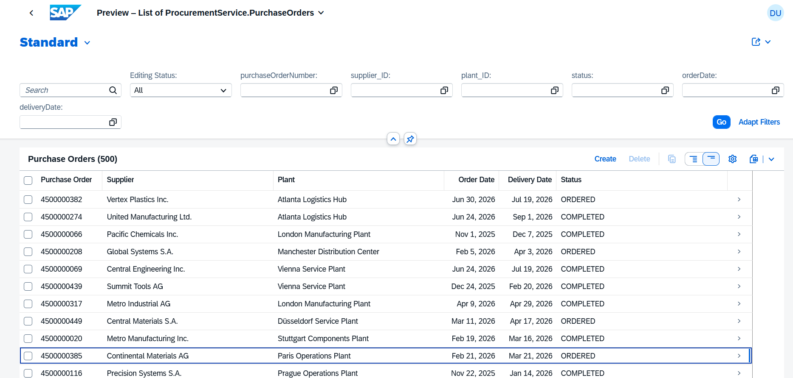
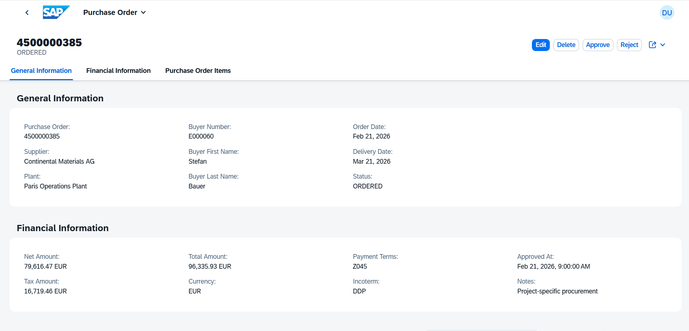
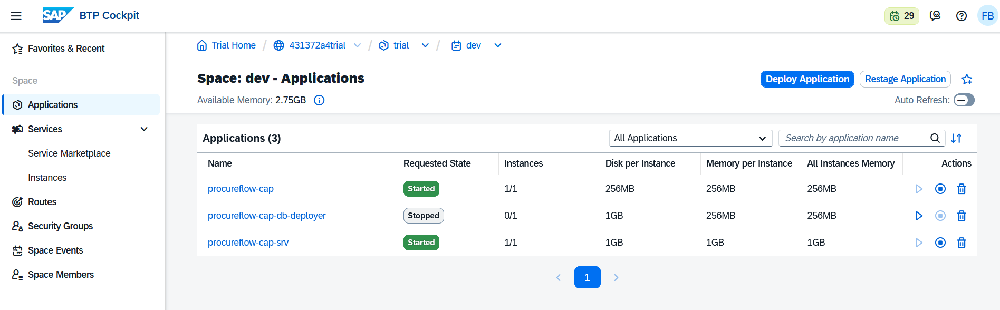

# ProcureFlow — Global Procurement & Supplier Management on SAP BTP

ProcureFlow is an end-to-end procurement management application built with the **SAP Cloud Application Programming Model (CAP)** and **SAP Fiori Elements**, and deployed on **SAP Business Technology Platform (BTP) Cloud Foundry**.

The project demonstrates the complete lifecycle of a cloud-native SAP application: domain modeling, OData services, custom business logic, transactional Fiori UI, role-based authorization, SAP HANA Cloud persistence, XSUAA authentication, and production deployment.

## Application Screenshots

### Purchase Order List



### Purchase Order Details



### SAP BTP Cloud Foundry Deployment



## Business Scenario

ProcureFlow models a global procurement process in which purchasing teams manage suppliers, materials, purchase requisitions and purchase orders across multiple companies and plants.

The application supports procurement activities such as:

- Managing purchase orders and purchase order items
- Selecting suppliers, plants and buyers through value helps
- Validating procurement transactions
- Automatically calculating purchase order values and taxes
- Approving and rejecting purchase orders
- Controlling access according to procurement roles
- Persisting transactional data in SAP HANA Cloud

## Application Architecture

```text
                    SAP BTP Cloud Foundry
┌─────────────────────────────────────────────────────────────┐
│                                                             │
│   Browser                                                   │
│      │                                                      │
│      ▼                                                      │
│   SAP Fiori Elements                                        │
│      │                                                      │
│      ▼                                                      │
│   Application Router                                        │
│      │                                                      │
│      ├────────► XSUAA                                       │
│      │          Authentication & Authorization              │
│      │                                                      │
│      ▼                                                      │
│   SAP CAP / Node.js                                         │
│   ProcurementService                                        │
│      │                                                      │
│      ▼                                                      │
│   HDI Container                                             │
│      │                                                      │
│      ▼                                                      │
│   SAP HANA Cloud                                            │
│                                                             │
└─────────────────────────────────────────────────────────────┘
```

## Technology Stack

| Layer | Technology |
|---|---|
| Application Framework | SAP Cloud Application Programming Model (CAP) |
| Backend | Node.js / JavaScript |
| Service | OData V4 |
| Frontend | SAP Fiori Elements / SAPUI5 |
| Data Modeling | CDS |
| Local Database | SQLite |
| Production Database | SAP HANA Cloud |
| Database Deployment | HDI Container |
| Authentication | SAP Authorization and Trust Management Service (XSUAA) |
| Authorization | CAP role-based authorization |
| Routing | SAP Application Router |
| Cloud Platform | SAP BTP Cloud Foundry |
| Deployment | Multi-Target Application (MTA) |
| Version Control | Git / GitHub |

## Domain Model

The procurement domain includes:

- Companies
- Plants
- Employees
- Suppliers
- Material Groups
- Materials
- Purchase Requisitions
- Purchase Requisition Items
- Purchase Orders
- Purchase Order Items
- Countries and currencies

The entities are connected through CDS associations to model realistic enterprise procurement relationships.

## Procurement Service

The CAP service exposes the procurement domain through an **OData V4 API** under:

```text
/procurement
```

The service provides transactional access to purchase orders and related procurement entities while master/reference data can be protected appropriately.

## Custom Business Logic

ProcureFlow extends CAP's generic CRUD capabilities with custom Node.js event handlers.

Examples include:

### Purchase Order Validation

The application validates business rules before purchase orders are created or changed, including:

- Delivery date cannot precede the order date
- Purchase orders cannot be created for blocked suppliers
- Supplier status is validated during procurement processing

### Purchase Order Item Validation

Purchase order items validate:

- Quantity must be greater than zero
- Unit price must be greater than zero

The application automatically calculates item net amounts.

### Automatic Purchase Order Totals

Changes to purchase order items trigger recalculation of:

- Net amount
- Tax amount
- Total amount

Tax calculation is based on procurement business rules, including country-dependent logic.

### Approval Workflow

Purchase orders expose custom bound CAP actions:

```text
approve
reject
```

Business rules prevent invalid state transitions, such as approving an already approved, rejected, completed or cancelled purchase order.

## SAP Fiori Elements UI

The application contains a transactional **Fiori Elements List Report and Object Page** for purchase order management.

Implemented UI capabilities include:

- Purchase Order List Report
- Purchase Order Object Page
- Purchase Order Item navigation
- Create and Edit functionality
- Draft handling
- Value helps
- Supplier selection
- Plant selection
- Buyer selection
- Approval information
- Purchase order totals
- Approve and Reject actions
- Annotation-driven UI configuration

The UI is primarily defined using CDS annotations rather than manually building individual UI controls.

## Security

ProcureFlow implements role-based authorization using CAP authorization annotations and SAP XSUAA.

Four procurement roles are defined:

| Role | Responsibility |
|---|---|
| ProcurementViewer | Read procurement information |
| ProcurementBuyer | Create and maintain procurement transactions |
| ProcurementApprover | Perform procurement approval activities |
| ProcurementAdmin | Administrative procurement access |

For local development, mocked authentication is used to test the authorization model.

For production deployment, the roles are represented as XSUAA scopes and role templates in `xs-security.json`.

## SAP HANA Cloud

Local development can use SQLite, while the deployed application uses **SAP HANA Cloud**.

CAP generates the required HANA deployment artifacts from the CDS model. The database layer is deployed through an **HDI container**.

The production build was validated using:

```bash
cds build --production
```

## SAP BTP Deployment

ProcureFlow has been successfully deployed to **SAP BTP Cloud Foundry**.

The production landscape consists of:

```text
Fiori Elements
      │
Application Router
      │
     XSUAA
      │
CAP Node.js Service
      │
HDI Container
      │
SAP HANA Cloud
```

The project is packaged as a Multi-Target Application using `mta.yaml`.

Example deployment flow:

```bash
mbt build
cf deploy mta_archives/procureflow-cap_1.0.0.mtar
```

The deployment creates and binds the required application and service components.

## Production Components

The deployed solution contains:

- `procureflow-cap` — Application Router
- `procureflow-cap-srv` — CAP Node.js service
- `procureflow-cap-db` — HANA HDI container
- `procureflow-cap-auth` — XSUAA service
- SAP HANA Cloud database

## Sample Data

The project includes realistic connected procurement seed data for development and demonstration.

The sample dataset includes **500 purchase orders** together with related:

- Suppliers
- Materials
- Plants
- Employees
- Purchase order items
- Companies
- Countries
- Currencies

This allows the application to demonstrate realistic enterprise procurement scenarios rather than isolated test records.

## Project Structure

```text
procureflow-cap/
│
├── app/
│   ├── purchaseorders/        # SAP Fiori Elements application
│   └── router/                # Application Router
│
├── db/
│   ├── data/                  # Procurement seed data
│   └── schema.cds             # CDS domain model
│
├── srv/
│   ├── procurement-service.cds
│   └── procurement-service.js
│
├── xs-security.json           # XSUAA scopes and role templates
├── mta.yaml                   # SAP BTP MTA deployment descriptor
├── package.json
└── README.md
```

## Running Locally

Install the dependencies:

```bash
npm install
```

Start the CAP development server:

```bash
cds watch
```

The CAP development environment uses local persistence and mocked authentication where configured.

## Production Build

Generate the production artifacts with:

```bash
cds build --production
```

Build the Multi-Target Application:

```bash
mbt build
```

Deploy to a targeted SAP BTP Cloud Foundry space:

```bash
cf deploy mta_archives/procureflow-cap_1.0.0.mtar
```

A Cloud Foundry environment with the required SAP HANA Cloud and XSUAA service entitlements is required.

## Project Highlights

This project demonstrates practical experience with:

- End-to-end SAP CAP application development
- Enterprise CDS domain modeling
- OData V4 services
- CAP event handlers and custom business logic
- Transactional SAP Fiori Elements applications
- Draft-enabled business objects
- Annotation-driven UI development
- Role-based CAP authorization
- SAP XSUAA
- SAP HANA Cloud and HDI
- SAP Application Router
- MTA packaging and Cloud Foundry deployment
- Git-based development workflow

## Deployment Status

**Successfully deployed and tested on SAP BTP Cloud Foundry with SAP HANA Cloud and XSUAA.**

The demonstration environment uses SAP BTP Trial infrastructure, so live application availability may vary when trial resources are stopped.

## Author

**Filmon Berihu Gebreslassie**

SAP CAP / ABAP Developer  
Focus: SAP BTP, CAP, RAP, Fiori, ABAP and enterprise application development